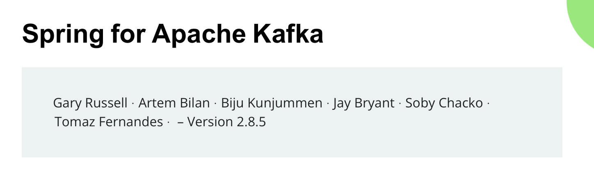

## Welcome! 👋

I'm a `Software Engineer` and `Open Source Contributor` from Rio de Janeiro.

<a href="https://twitter.com/tomazfernandes_">
  
</a>
<a href="https://www.linkedin.com/in/tomazfernandes/">
  
</a>

<br />

### \>> Open Source Contributions <<

Here's some of what I've had the opportunity of contributing so far.

### 🍃 Spring Cloud AWS

```java
String projectName = "Spring Cloud AWS";
String projectDescription = "The project aims to simplify " 
        + "integrating Spring applications with AWS services.";
String myContribution = "I've had the opportunity to rewrite "
        + "the SQS integration from the ground up, based on my experience "
        + "of being a Spring Kafka contributor for about two years.";
Integer linesOfCodeAndDocsCommited = 30_000; 
```
> @see <a href="https://docs.awspring.io/spring-cloud-aws/docs/3.0.0-M2/reference/html/index.html#sqs-support">Spring Cloud AWS SQS Integration Documentation 📚</a>


The team is doing a great job in reimagining the integrations - try the latest version out and provide feedback!

<a align="center" href="https://github.com/awspring/spring-cloud-aws" title="Spring Cloud AWS">
</a>


### Apache Pulsar Messaging Framework
### Parallel Kafka Consumer Messaging Framework

```java
String projectNameOne = "Apache Pulsar Messaging Framework";
String projectNameTwo = "Parallel Kafka Consumer Messaging Framework";
String projectDescription = "The projects aim to simplify integrating with Apache Pulsar "
        + "and Parallel Kafka Consumer"
```

The SQS integration I created for the `Spring Cloud AWS SQS` project is actually a meta-messaging-framework, and I've created the `Apache Pulsar Messaging Framework` and `Parallel Kafka Consumer Messaging Framework` projects out of it.

Those are powerful, high-throughput solutions, non-blocking solutions.

These projects have zero dependencies to `AWS SDK`, and have approximately `35` and `15` classes respectively.

<a align="center" href="https://github.com/tomazfernandes/apache-pulsar-messaging-framework" title="Apache Pulsar Messaging Framework">
</a>

<a align="center" href="https://github.com/tomazfernandes/parallel-kafka-consumer-messaging-framework" title="Parallel Kafka Consumer Messaging Framework">
</a>


### 🍃 Load Test App for Spring Cloud AWS

```java
String projectName = "Personal project for Spring Cloud AWS SQS load tests";
String projectDescription = "Project to perform simple load tests " 
        + "with the SQS Integration on AWS ECS.";
String projectInfrastructure = "This app features " + Terraform.class
        + " and " + GitHubActions.class + " CI / CD pipeline for deployment on ECS.";
```

Results so far with a **single ECS instance** and up to **1M messages** show up to:
```text
* **17K** messages / second with 4 vcpu and 8 GB memory
* **8K** messages / second with 2 vcpu and 4GB memory
* **4K** messages / second with 1 vcpu and 2GB memory
```

Check the app repo out and perform some tests of your own!

<a align="center" href="https://github.com/tomazfernandes/sqs-load-test" title="Sqs Load Test">
</a>

<br />

### 🍃 Spring for Apache Kafka

```java
String projectName = "Spring for Apache Kafka";
String projectDescription = "The project brings familiar Spring " 
        + " abstractions to Apache Kafka.";
String myContribution = "I've had the opportunity to contribute the "
        + NonBlockingDelayedRetries.class + " feature.";
Integer linesOfCodeAndDocsCommited = 20_000; 
```

> @see <a href="https://docs.awspring.io/spring-cloud-aws/docs/3.0.0-M2/reference/html/index.html#sqs-support">Spring Kafka Documentation for the Non-Blocking Retries feature 📚</a>

I've worked closely with the project's team on this feature, interacting with users on `Github Issues` and `Stack Overflow`, reviewing feature-related PRs, adding new functionalities, and so on.


<a href="https://docs.spring.io/spring-kafka/reference/html/">
  
</a>

<br />

### 🍃 Stack Overflow

```java
String projectName = "StackOverflow";
String myContribution = "I've been answering questions about the "
        + NonBlockingDelayedRetries.class + " feature and general distributed ";
        + "systems questions around Kafka and Spring Kafka.";
Integer reputation = 2_000; 
```

> @see <a href="https://stackoverflow.com/users/3692447/tomaz-fernandes">my Stack Overflow profile 📚</a>
