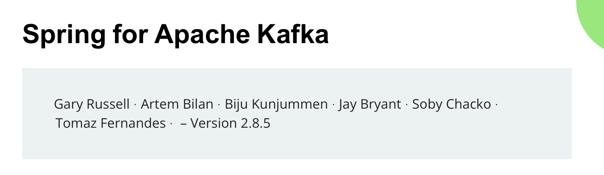

## Hi, I'm Tomaz Fernandes 👋

Software Engineer based in Rio de Janeiro, Brazil. 10+ years building backend and distributed systems.

- 🍃 Lead maintainer for SQS in [Spring Cloud AWS](https://github.com/awspring/spring-cloud-aws)
- ☁️ [AWS Community Builder](https://builder.aws.com/community/@tomazfernandes)
- ✍️ I write about distributed systems, messaging, and production-safe engineering at **[tomazfernandes.dev](https://tomazfernandes.dev/)**
- 📚 Author of Spring Cloud AWS articles on [Baeldung](https://www.baeldung.com/author/tomazfernandes)

   

---

### Open-source work

**[Spring Cloud AWS](https://github.com/awspring/spring-cloud-aws)** — Rewrote the SQS integration for version 3.0 from the ground up, now the lead maintainer for the SQS module. Day-to-day: designing features, reviewing PRs, helping users in issues and discussions.

→ [SQS integration documentation](https://docs.awspring.io/spring-cloud-aws/docs/current/reference/html/index.html#sqs-integration)

**[Spring for Apache Kafka](https://github.com/spring-projects/spring-kafka)** — Contributed the [non-blocking delayed retries](https://docs.spring.io/spring-kafka/reference/retrytopic.html) feature. Continue to help with feature evolution, issue triage, and community support via GitHub issues and Stack Overflow. Credited as an author on the [2.x reference documentation](https://docs.spring.io/spring-kafka/docs/2.8.x/reference/html/).

---

### Writing

[**tomazfernandes.dev**](https://tomazfernandes.dev/) is where I publish long-form technical notes on the systems I work on — messaging pipelines, reliability patterns, and the tradeoffs behind production-safe engineering. Recent:

- [What Happens Between @SqsListener and Your Method](https://tomazfernandes.dev/posts/from-sqslistener-to-your-method/)

I also write on [Baeldung](https://www.baeldung.com/author/tomazfernandes) — intros and deep dives on Spring Cloud AWS.
